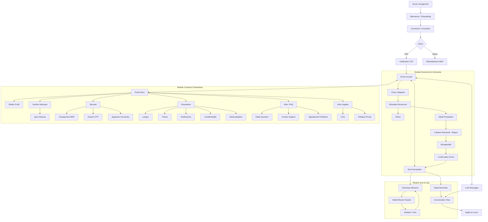
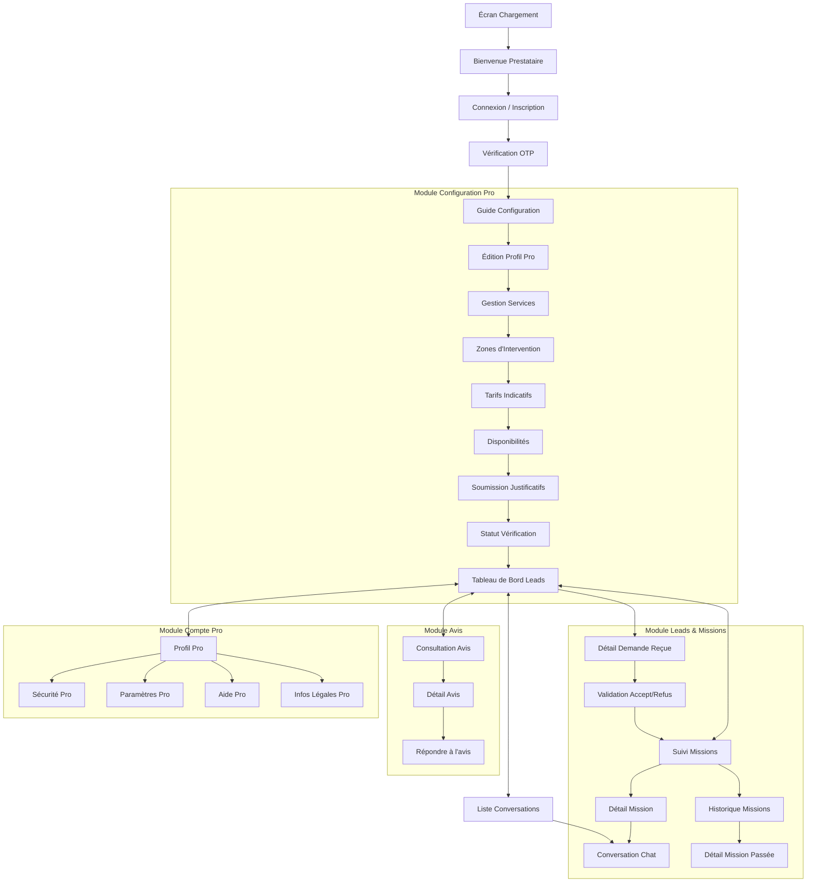

# 🗺️ Schéma de Navigation Schématique Complet

Ce document présente l'assemblage logique et les transitions entre tous les écrans réalisés. Il sert de plan de montage avant l'implémentation.

---

## 📱 Flux Client (User Flow)

---

## 🛠️ Flux Prestataire (Provider Flow)

---

## 🔗 Transitions Critiques (Action/Réaction)

| Événement déclencheur | Écran Source | Écran Destination |
| :--- | :--- | :--- |
| **Envoi Demande** | Récapitulatif (Client) | Confirmation -> Suivi Demandes |
| **Acceptation Lead** | Détail Demande (Presta) | Missions en cours |
| **Fin de mission** | Détail Mission (Presta) | Détail Mission (Client) -> Notation |
| **Nouvel Avis** | Notification (Presta) | Détail de l'avis |
| **Alerte Support** | Signalement (Client) | Confirmation -> Accueil |

---
*Ce schéma constitue la base structurelle pour l'assemblage des écrans.*
